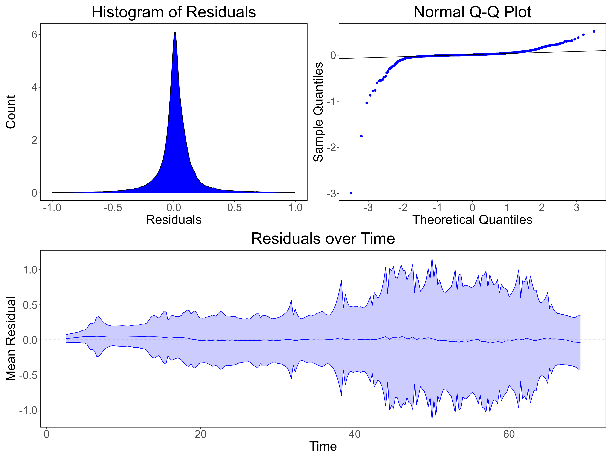
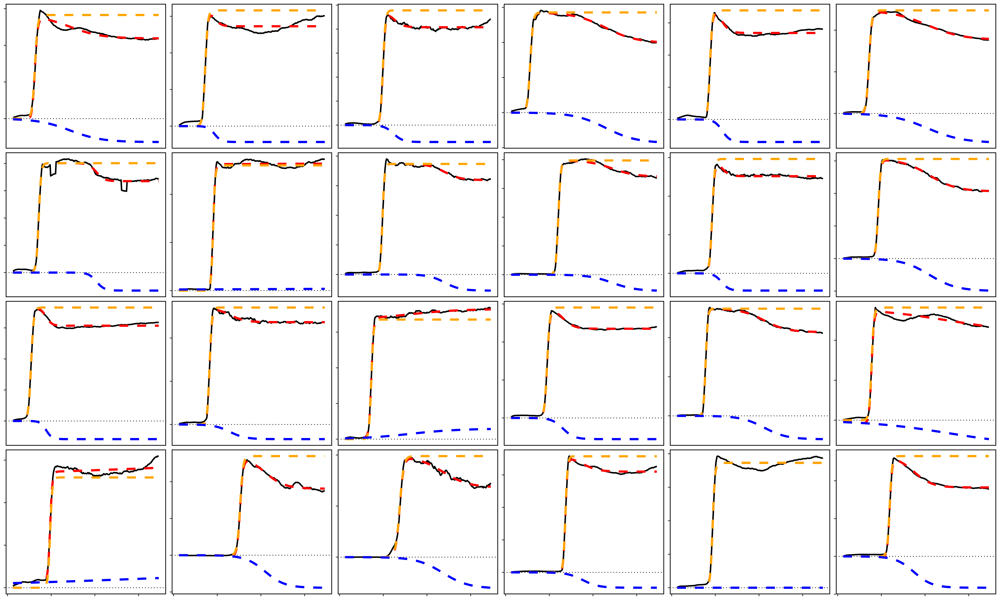
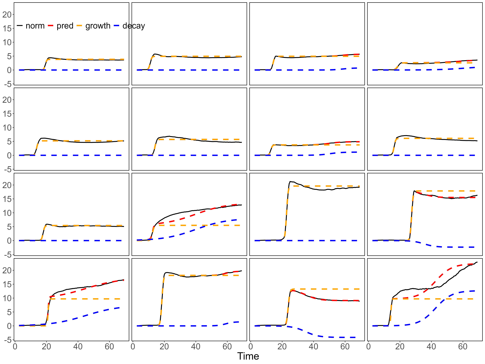

```{r, echo=FALSE}
library(tidyverse)
library(latex2exp)
library(skimr)
library(arrow)
library(zoo)

main_theme <- theme(
  plot.title = element_text(size = 30, hjust = 0.5),
  axis.title = element_text(size = 24),
  axis.text = element_text(size = 20),
  legend.title = element_text(size = 24),
  legend.text = element_text(size = 20),
  strip.text = element_text(size = 24),
  panel.background = element_rect(fill = "white"),
  panel.border = element_rect(color = "black", fill = NA, linewidth = 1)
)
```

## Introduction
This R project contains code for modeling the kinetics of the prion protein misfolding in the RT-QuIC assay. This misfolding is modeled using a two-component model, with the primary and secondary phases of the reaction being modeled separately.

The model is described by the following equations:

$$
\begin{aligned}
  g_1(t)&=\frac{S_1}{1+e^{a_1(b_1-\text{t})}}\\
  g_2(t)&=\frac{S_2}{1+e^{a_2(b_2-\text{t})}}
\end{aligned}
$$

where $S_1$ and $S_2$ represent the primary and secondary phase asymptotes, respectively. Parameters $a_1$ and $a_2$, modulate the steepness of the inflection point; $b_1$ and $b_2$ represent the midpoint of the inflection point of the curves. The model can be described as the sum of these two logistic functions.

$$
f(t)=g_1(t)+g_2(t)
$$

## Example Graph

```{r Example Graph, echo=FALSE}
#| fig-caption: "Example Graph highlighting the sum of the two components. The blue line is the combined component, the red line is the growth component, and the green line is the decay component."
#| fig-height: 6
#| fig-width: 12

S1 <- 25
S2 <- -12.5
a1 <- 1.5
a2 <- 0.5
b1 <- 10
b2 <- 16

tex_label <- TeX(sprintf(r"($f(t)=\frac{%s}{1+e^{%s(%s - t)}} + \frac{%s}{1+e^{%s(%s - t)}}$)", S1,a1,b1,S2,a2,b2),output = "character")

df_example <- tibble(time = seq(0, 48, 0.25)) %>%
  mutate(
    growth = S1 / (1 + exp(a1 * (b1 - time))),
    decay = S2 / (1 + exp(a2 * (b2 - time))),
    combined = growth + decay,
    raw = combined + rnorm(length(time), 0, 0.4)
  )

df_example %>%
  pivot_longer(c(growth, decay, combined), names_to = "type", values_to = "value") %>%
  mutate(type = factor(type, levels = c("growth", "decay", "combined"), labels = c("Growth", "Decay", "Combined"))) %>%
  ggplot(aes(time, value, color = type)) +
  geom_point(aes(y = raw), size = 0.5, color = "black") +
  geom_line(linewidth = 1.2) +
  annotate(
    "text", x = 20, y = 5, hjust = 0, size = 6, parse = TRUE, 
    label = tex_label
  ) +
  scale_color_manual(values = c("black", "red", "blue", "green")) +
  labs(x = "Time (hr)", y = "Normalized Fluorescence") +
  main_theme +
  theme(
    strip.text = element_blank(),
    legend.title = element_blank(),
    legend.position = "inside",
    legend.position.inside = c(0, .95),
    legend.justification = c(0, 1),
    legend.background = element_blank()
  )
```

## How do the parameters affect the curves?
```{r, echo=FALSE}
fit_single <- function(x, S, a, b) {
  return(S / (1 + exp(a * (b- x))))
}

coefs <- tibble(
  S1 = -5, S2 = 10, S3 = 15,
  a1 = 1, a2 = 0.5, a3 = 0.25,
  b1 = 20, b2 = 30, b3 = 40
)

coefs_long <- coefs %>%
  pivot_longer(everything(), names_to = "coefficient", values_to = "value")

combos <- expand.grid(letters = c("S", "a", "b"), numbers = 1:3)

df_coef <- tibble(
  coefficient = paste0(combos$letters, combos$numbers),
  x = c(
    30, 30, coefs$b1 - 5, 
    30, 30, coefs$b2 - 5,
    30, 30, coefs$b3 - 5
  ),
  y = c(
    coefs$S1 - 1, coefs$S3 / 2 + 4, coefs$S3 / 2,  
    coefs$S2 - 1, coefs$S3 / 2, coefs$S3 / 2,
    coefs$S3 - 1, coefs$S3 / 2 - 4, coefs$S3 / 2
  ), 
) %>%
  left_join(coefs_long, by = "coefficient") %>%
  mutate(
    coef = str_extract(coefficient, "^[A-z]"),
    mod_number = as.factor(str_extract(coefficient, "[0-9]$")),
    label = paste(coef, "=", value)
  )

df_ <- tibble(
  time = seq(0, 48, 0.25),
  S1 = fit_single(time, coefs$S1, coefs$a1, coefs$b1),
  S2 = fit_single(time, coefs$S2, coefs$a1, coefs$b1),
  S3 = fit_single(time, coefs$S3, coefs$a1, coefs$b1),
  a1 = fit_single(time, coefs$S3, coefs$a1, coefs$b1),
  a2 = fit_single(time, coefs$S3, coefs$a2, coefs$b1),
  a3 = fit_single(time, coefs$S3, coefs$a3, coefs$b1),
  b1 = fit_single(time, coefs$S3, coefs$a1, coefs$b1),
  b2 = fit_single(time, coefs$S3, coefs$a1, coefs$b2),
  b3 = fit_single(time, coefs$S3, coefs$a1, coefs$b3)
) %>%
  pivot_longer(-time, names_to = "parameter", values_to = "value") %>%
  mutate(
      coef = case_when(
        str_detect(parameter, "S") ~ "S", 
        str_detect(parameter, "a") ~ "a", 
        str_detect(parameter, "b") ~ "b"
      ),
      mod_number = as.factor(str_extract(parameter, "[0-9]$"))
  )

make_param_plot <- function(coef) {
  df_c <- df_coef %>%
    filter(coef == !!coef)

  df_ %>%
    filter(coef == !!coef) %>%
    ggplot(aes(time, value, color=mod_number)) +
    geom_line(show.legend = FALSE, linewidth=1.2) +
    geom_text(aes(x=x, y=y, label = label), data = df_c, size=6, show.legend = FALSE) +
    main_theme +
    theme(
      legend.position = "bottom",
      axis.title = element_blank(),
    )
}
```

```{r S Param Plot, echo=FALSE}
#| fig-height: 6
#| fig-width: 12
make_param_plot("S")
```

The $S$ parameter affects the height of the asymptote. For example, if $S=10$, the curve will approach 10 in the equillibrium phase as $t\rightarrow\infty$. If $S=0$, the other parameters will not affect the curve, and therefore become redundant.

---

```{r a Param Plot, echo=FALSE}
#| fig-height: 6
#| fig-width: 12
make_param_plot("a")
```

The $a$ parameter affects the steepness of the inflection point. A lower value of $a$ will result in a smoother curve, and as $a\rightarrow0$, the curve will approach a constant value at $S/2$. Alternatively, as $a\rightarrow\infty$, the curve will approach $S$ instantaneously at when $t=b$.

---

```{r b Param Plot, echo=FALSE}
#| fig-height: 6
#| fig-width: 12
make_param_plot("b")
```

The $b$ parameter affects the timing of the inflection point (i.e. when the curve reaches $S/2$). This value can range from $-\infty\rightarrow\infty$, but for the purpose of this analysis, $b$ is constrained to positive values.

---

## The Training Data
The data is a time series of fluorescence measurements from a single positive sample over many reactions. Both RT-QuIC and Nano-QuIC data were included in this data. The data is normalized to the eighth time-point, and the time-points are evenly spaced by 15 min between 0 and 72 hours. Only time-points $t>0$ were included to account for the artificially increased fluorescence values before the reaction has reached thermal equillibrium.

```{r, eval=TRUE, echo=FALSE}
raw_file <- "data/data.parquet"

group_list <- c("sample", "wells", "dilutions", "assay", "reaction")

df_ <- raw_file %>%
  read_parquet() %>%
  mutate(
    across(c(reaction, wells, dilutions, assay, mortem, sample_type, animal, sample), as.factor)
  ) %>%
  select(-c(norm, deriv)) %>%
  filter(
    time != 0,
    sample %in% c("P"), time <= 72
  )

skim(df_)
```

## Normalizing the Data
The data is first smoothed using a rolling mean, and then normalized to the eighth time point. The first and second derivatives were then estimated from the normalized data which made finding time points of inflection easier.

```{r Normalize, eval=TRUE}
norm_n_der <- function(df, x, y, norm_point, groups, window=3, smooth=10, zero=TRUE) {
  df %>%
    mutate(
      norm   = rollmean(!!sym(y), smooth, na.pad=TRUE),
      norm   = norm / norm[norm_point] - ifelse(zero, 1, 0),
      deriv  = (lead(norm, window) - lag(norm, window)) / (lead(!!sym(x), window) - lag(!!sym(x), window)),
      deriv2 = (lead(deriv, window) - lag(deriv, window)) / (lead(!!sym(x), window) - lag(!!sym(x), window)),
      .by = all_of(groups)
    )
}

df_test <- norm_n_der(df_, "time", "rfu", 8, group_list)
```

### Example of Normalized Data
```{r Normalize Plot, echo=FALSE}
#| fig-height: 6
#| fig-width: 12
rxn <- unique(df_$reaction)[1]
well <- unique(df_$wells)[1]
df_raw <- df_ %>%
  filter(reaction == rxn, wells == well) %>%
  rename(raw = rfu) %>%
  pivot_longer(raw, names_to = "metric") %>%
  mutate(type = "raw")

df_norm <- df_test %>%
  filter(reaction == rxn, wells == well) %>%
  pivot_longer(c(norm, deriv, deriv2), names_to = "metric") %>%
  mutate(type = "norm")

df_raw %>%
  bind_rows(df_norm) %>%
  mutate(
    metric = factor(
      metric, 
      levels = c("raw", "norm", "deriv", "deriv2"), 
      labels = c("Raw", "Normalized", "1st Derivative", "2nd Derivative")
    )
  ) %>%
  ggplot(aes(time, value, color = metric)) +
  geom_line(linewidth = 1.2, show.legend = FALSE) +
  geom_hline(yintercept = 0, linetype = "dashed") +
  facet_wrap(vars(fct_inorder(metric)), scales = "free_y", ncol = 2, strip.position = "right") +
  scale_color_manual(values = c('#7b3294','#c2a5cf','#a6dba0','#008837')) +
  main_theme +
  theme(
    axis.title = element_blank(),
    legend.title = element_blank(),
    legend.position = "inside",
    legend.position.inside = c(0, .85),
    legend.justification = c(0, 1),
    legend.background = element_blank()
  )
```

## Estimating Starting Values
The model uses the `nls()` function from the `stats` package. Because this is a parametric model, coefficients are first estimated using certain landmarks of the raw data.

```{r, eval=TRUE}
df_test_sum <- df_test %>%
  summarize(
    max_time             = max(time, na.rm=TRUE),
    growth_scale         = max(deriv, na.rm=TRUE),
    peak_norm            = norm[which.min(deriv2)],
    time_to_growth_max   = time[norm == peak_norm][1],
    time_to_growth_mid   = time[which.max(deriv)],
    max_equillibrium     = max(norm[time > time_to_growth_max], na.rm=TRUE),
    min_equillibrium     = min(norm[time > time_to_growth_max], na.rm=TRUE),
    max_decay            = max_equillibrium - peak_norm,
    min_decay            = min_equillibrium - peak_norm,
    equillibrium         = ifelse(abs(min_decay) > max_decay, min_equillibrium, max_equillibrium),
    time_to_equillibrium = time[norm == equillibrium][1],
    peak_decay           = equillibrium - peak_norm,
    time_to_decay        = time_to_equillibrium - time_to_growth_max,
    time_to_decay_mid    = time_to_growth_max + time_to_decay / 2,
    decay_slope          = replace_na(peak_decay / time_to_decay, 0),
    decay_scale          = abs(decay_slope),
    .by = group_list
  )
```

## Fitting the Model
The model first attempts to fit a double sigmoidal model to the data using the landmarks shown above. If this fails, the function then reverts to a single sigmoidal model. It then re-attempts the double sigmoidal fit using the coefficients generated from the single model. If that fails again, the model returns just the single sigmoidal model.
```{r, eval=TRUE}
fit_model <- function(data, peak_norm, time_to_growth_mid, growth_scale, peak_decay, time_to_decay_mid, decay_scale,max_time, ...) {
  form1 <- norm ~ (S1 / (1 + exp(a1 * (b1 - time))))
  form2 <- as.formula(paste(deparse(form1), "+ (S2 / (1 + exp(a2 * (b2 - time))))"))

  fit_timeout   <- 10  # seconds per nls() call
  fit_control   <- nls.control(maxiter = 100, warnOnly = TRUE)
  nls_bounded <- function(...) {
    setTimeLimit(elapsed = fit_timeout, transient = TRUE)
    on.exit(setTimeLimit(elapsed = Inf, transient = TRUE), add = TRUE)
    nls(..., control = fit_control)
  }

  peak_scalar <- 2
  is_negative_decay <- peak_decay < 0

  lower_S1 <- peak_norm
  lower_a1 <- 0.1
  lower_b1 <- 0
  lower_S2 <- ifelse(is_negative_decay, -peak_norm * peak_scalar, 0)
  lower_a2 <- 0
  lower_b2 <- -time_to_decay_mid

  upper_S1 <- peak_norm * peak_scalar
  upper_a1 <- 20
  upper_b1 <- max_time
  upper_S2 <- ifelse(is_negative_decay, 0, peak_norm * peak_scalar)
  upper_a2 <- 10
  upper_b2 <- max_time

  fit_single <- function(...) {
    single_mod <- NULL
    single_mod <- nls_bounded(
      form1, data = data,
      start = list(
        S1 = peak_norm,
        a1 = peak_norm,
        b1 = time_to_growth_mid
      ),
      algorithm = "port",
      lower = c(S1 = lower_S1, a1 = lower_a1, b1 = lower_b1),
      upper = c(S1 = upper_S1, a1 = upper_a1, b1 = upper_b1)
    ) %>%
      try(silent = TRUE)
    return(single_mod)
  }

  fit_double <- function(...) {
    mod <- NULL
    mod <- nls_bounded(
      form2, data = data,
      start = list(
        S1 = peak_norm,  a1 = growth_scale, b1 = time_to_growth_mid,
        S2 = peak_decay, a2 = decay_scale,  b2 = time_to_decay_mid
      ),
      algorithm = "port",
      lower = c(
        S1 = lower_S1, a1 = lower_a1, b1 = lower_b1, 
        S2 = lower_S2, a2 = lower_a2, b2 = lower_b2
      ),
      upper = c(
        S1 = upper_S1, a1 = upper_a1, b1 = upper_b1, 
        S2 = upper_S2, a2 = upper_a2, b2 = upper_b2
      )
    ) %>%
      try()

    if(is.null(mod)) {
      mod <- try(fit_single())
      
      if(is.null(mod)) return(NULL)
      
      coefs <- coef(mod)
      S1 <- coefs[1]
      a1 <- coefs[2]
      b1 <- coefs[3]

      mod <- nls_bounded(
        form2, data = data,
        start = list(
          S1 = S1, a1 = a1, b1 = b1,
          S2 = peak_decay, a2 = decay_scale, b2 = time_to_decay_mid
        ),
        algorithm = "port",
        lower = c(
          S1 = lower_S1, a1 = lower_a1, b1 = lower_b1, 
          S2 = lower_S2, a2 = lower_a2, b2 = lower_b2
        ),
        upper = c(
          S1 = upper_S1, a1 = upper_a1, b1 = upper_b1, 
          S2 = upper_S2, a2 = upper_a2, b2 = upper_b2
        )
      ) %>%
        try()
    }
    return(mod)
  }
  fit_double()
}
```

## Results

### Residual Visualizations


### Example Fits


### Samples with the Highest Deviations from the Model



